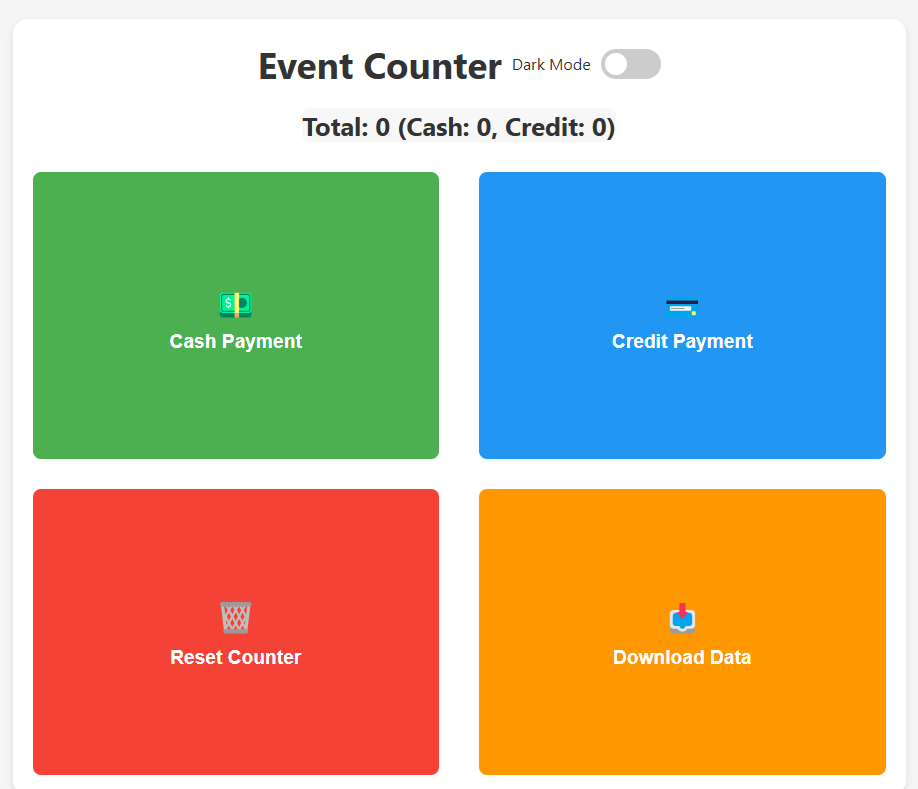

# Event Capacity Counter

A lightweight, browser-based counter application for tracking event attendance by payment method.



[USE IT HERE](https://actuallyfro.github.io/Event-Counter/)

## Features

- **Dual Payment Tracking**: Count cash and credit card payments separately
- **Auto-Saving**: All data is automatically stored in your browser's localStorage
- **Timestamp Recording**: Each entry records both payment type and precise timestamp
- **Dark/Light Mode**: Toggle between visual themes for different lighting conditions
- **Data Export**: Download all recorded data as a JSON file
- **Reset Protection**: Confirmation dialog prevents accidental data loss
- **Data Analysis**: Visualize and analyze your transaction data (see Analysis section)

## Usage

### Getting Started

1. Open the HTML file in any modern web browser
2. No installation or internet connection required

### Main Controls

- **Cash Payment Button (Green)**: Click to record a cash payment
- **Credit Payment Button (Blue)**: Click to record a credit card payment
- **Counter Display**: Shows total count with breakdown by payment method
- **Dark Mode Toggle**: Switch between light and dark visual themes

### Data Management

- **Reset Button (Red)**: Clears all counters and stored data (requires confirmation)
- **Download Button (Orange)**: Exports all transaction data as a JSON file

## Data Analysis


[USE IT HERE - Analysis](https://actuallyfro.github.io/Event-Counter/Analysis.html)

The separate Analysis.html file provides advanced data visualization tools to help you understand transaction patterns:

### Analysis Features

- **Interactive Charts**: Visualize data with responsive, interactive D3.js charts
- **Multiple Time Views**: Analyze data grouped by minute or hour
- **Stacked Bar Chart**: View cash and credit transactions side-by-side
- **Bollinger Band Analysis**: Track transaction trends with statistical bands
- **Hourly Averages**: See running average transaction rates
- **Detailed Tooltips**: Hover over data points for detailed information

### Using the Analysis Tool

1. Open Analysis.html in a modern web browser
2. Upload your JSON data file (exported from the main application)
3. Toggle between minute and hourly views as needed
4. Interact with charts to view detailed statistics

## Technical Details

### Data Structure

The application stores data in the following format:

```json
{
  "cashCount": 5,
  "creditCount": 3,
  "transactions": [
    {
      "type": "cash",
      "timestamp": "2025-02-19T15:32:41.123Z"
    },
    {
      "type": "credit",
      "timestamp": "2025-02-19T15:35:12.456Z"
    },
    ...
  ]
}
```

### Storage

- All data is stored in the browser's localStorage under the key `eventCounterState`
- Dark mode preference is stored separately under the key `darkMode`
- Data persists between browser sessions

### Export Format

Downloaded data is provided as a JSON file with the naming convention:
`event-counter-data-YYYY-MM-DD.json`

## Browser Compatibility

- Chrome 60+
- Firefox 55+
- Safari 11+
- Edge 16+

### Analysis Tool Requirements

- Modern browser with ES6 support
- D3.js library (loaded via CDN)

## Privacy

- All data remains on your local device
- No internet connection or external services required
- No tracking or analytics included

## Development

### File Structure

- **index.html**: Main counter application with HTML, CSS, and JavaScript
- **Analysis.html**: Data visualization tool with D3.js charts

### Customization

The interface can be customized by modifying the CSS variables at the top of the style section.

-- ALL generated with Claude.ai
